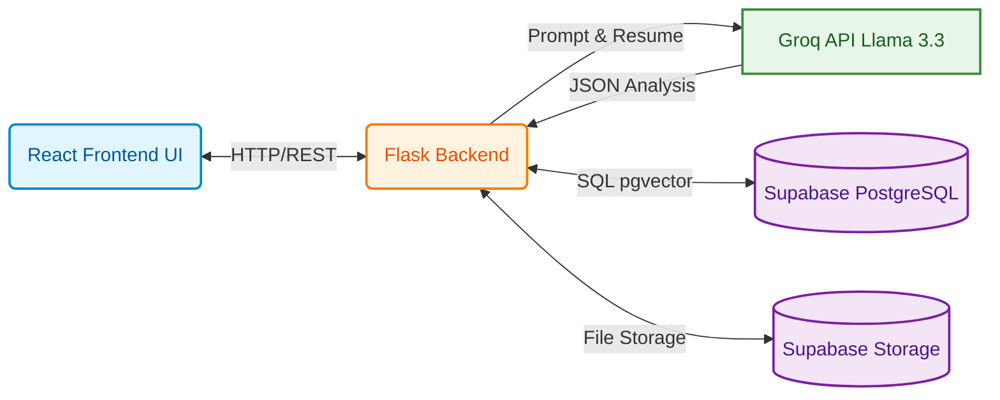

# Team Neural Runners — Intelligent Candidate Discovery

A **6-stage multi-agent pipeline** for semantically ranking candidates against a Job Description, with JD understanding, per-candidate reasoning, and a self-correcting critic loop.

---


## System Architecture

The application is built using a modern decoupled architecture:



### Components:
1. **Frontend (React + Vite):** Provides a conversational UI where users can paste job descriptions, upload resumes, and input their API keys.
2. **Backend (Python Flask):** Hosts the REST API, handles PDF parsing (`pypdf`), orchestrates the multi-agent AI pipeline, and communicates with Supabase.
3. **Database (Supabase):** Stores the candidates metadata and uses `pgvector` to perform lightning-fast semantic vector searches on the candidates.
4. **LLM (Groq):** Powered by the lightning-fast `llama-3.3-70b-versatile` model. It is used to analyze resumes and run the multi-agent reasoning pipeline (JD Decomposition, Evaluation, and Critic).

## LLM & API Keys

The system requires an LLM to power the intelligent agent stages. We use **Groq** for ultra-low latency inference. 

**Providing your Groq API Key:**
There are two ways to securely provide your API key:
1. **Frontend UI:** You can paste your Groq API key directly into the bottom-left settings panel of the web interface. It will be securely stored in your browser's `localStorage` and sent with requests.
2. **Backend Environment Variable:** You can set the `GROQ_API_KEY` in your `backend/.env` file. The backend will automatically fall back to this environment variable if no key is provided via the UI.

> **Fallback Mode:** If no API key is provided (or if the API key is invalid), the system will gracefully degrade. The backend will catch the failure and return a `mock_analysis` or use rule-based heuristic scoring instead of LLM evaluations, ensuring the app never crashes!


## AI Pipeline Architecture

```mermaid
flowchart TD
    %% Define styles
    classDef input fill:#e8f5e9,stroke:#2e7d32,stroke-width:2px,color:#1b5e20
    classDef llm fill:#f3e5f5,stroke:#7b1fa2,stroke-width:2px,color:#4a148c
    classDef filter fill:#e3f2fd,stroke:#1565c0,stroke-width:2px,color:#0d47a1
    classDef standard fill:#fff3e0,stroke:#e65100,stroke-width:2px,color:#e65100
    classDef output fill:#eceff1,stroke:#455a64,stroke-width:2px,color:#263238

    JD([📄 Raw Job Description Text]):::input
    Cands[(Candidate Dataset JSONL)]:::input
    
    subgraph Data Prep
        Stage0[<b>Stage 0: Ingestion & Normalization</b><br/>Parses Profile, Activity, Skills]:::standard
    end
    Cands --> Stage0
    
    JD --> Stage1[<b>Stage 1: JD Decomposer Agent</b><br/><i>LLM / Heuristic Fallback</i><br/>Extracts Requirements & Weights]:::llm
    
    Stage1 -- RequirementSpec --> Stage2[<b>Stage 2: Fast Pre-Filter</b><br/><i>FAISS Vector Search</i><br/>Funnels down to top 20-30%]:::filter
    Stage0 -. normalized candidates .-> Stage2
    
    Stage2 -- Shortlist (~50-150 cands) --> Stage3[<b>Stage 3: Per-Candidate Evaluator</b><br/><i>LLM / Heuristic (Concurrent)</i><br/>Scores factors independently]:::llm
    
    Stage3 -- EvaluationResults --> Stage4[<b>Stage 4: Critic / Verifier Agent</b><br/><i>LLM / Rule Fallback</i><br/>Deflates inflated scores & adds flags]:::llm
    
    Stage4 -- CriticResults --> Stage5[<b>Stage 5: Ranking Synthesis</b><br/><i>Math Engine</i><br/>Weighted math aggregation]:::standard
    
    Stage5 --> Final([🏁 Ranked Output CSV / JSON]):::output
```

### What each stage contributes to judging criteria

| Criterion | Stage |
|---|---|
| Deep JD understanding | Stage 1 (structured spec, inferred weights) |
| Semantic fit (not keyword matching) | Stage 2 + Stage 3 (claim extraction) |
| Behavioral signal integration | Stage 3 (separate behavioral sub-score) |
| Self-correction / contextual relevance | Stage 4 (critic loop) |
| Fast, accurate ranked output | Stage 2 funnel + Stage 5 |

---

## Project Structure

```
.
├── backend/
│   ├── agents/
│   │   ├── stage0_ingestion.py      # Entity normalization
│   │   ├── stage1_jd_decomposer.py  # JD → RequirementSpec
│   │   ├── stage2_prefilter.py      # FAISS retrieval
│   │   ├── stage3_evaluator.py      # Per-candidate evaluation
│   │   ├── stage4_critic.py         # Critic / verifier
│   │   └── stage5_synthesizer.py   # Score synthesis
│   ├── orchestrator.py              # Pipeline controller
│   └── app.py                       # Flask API
├── frontend/                        # React + Vite UI
├── precompute.py                    # One-time embedding precomputation
├── rank.py                          # CLI ranking script
├── requirements.txt
└── .env.example
```

---

## Setup

### 1. Install dependencies

```bash
pip install -r requirements.txt
```

### 2. Place dataset

```
dataset/candidates.jsonl
```

### 3. (Optional) Configure Groq API key

Copy `.env.example` to `.env` and fill in your key:

```bash
copy .env.example .env
```

Get a free Groq API key at [console.groq.com/keys](https://console.groq.com/keys).

> **Without an API key:** The system runs entirely via the heuristic fallback pipeline (FAISS + rule-based scoring). All 6 stages still execute — LLM steps are simply skipped and replaced by their deterministic equivalents.

---

## Execution

### Step 1 — Pre-computation (one-time)

Filters the dataset, generates embeddings, and saves FAISS index + parquet metadata:

```bash
python precompute.py
```

*Outputs: `candidates.index` and `candidates_metadata.parquet`*

### Step 2 — Ranking

#### Fast mode (default, <5 min, submission-safe)

```bash
python rank.py --candidates dataset/candidates.jsonl --out team_neural_runners.csv
```

#### Agentic mode (full multi-agent pipeline, requires Groq API key)

```bash
python rank.py --candidates dataset/candidates.jsonl --out output_agentic.csv --agentic
```

### Step 3 — Validate output

```bash
python dataset/validate_submission.py team_neural_runners.csv
```

---

## API (Demo / Frontend)

Start the backend:

```bash
cd backend && python app.py
```

Start the frontend:

```bash
cd frontend && npm run dev
```

### Endpoints

| Method | Endpoint | Description |
|---|---|---|
| `POST` | `/api/rank` | Run full pipeline on JD text |
| `GET` | `/api/status` | Current pipeline stage (for UI progress) |
| `GET` | `/api/health` | Health check |

---

## Methodology Summary

The system avoids the single-pass "embed JD + cosine similarity" trap by introducing structured understanding at Stage 1 and evidence-based evaluation at Stage 3. The key design decisions:

1. **Spec over raw text**: Stage 2 embeds the structured RequirementSpec summary — not the raw JD — for cleaner semantic retrieval.
2. **Sub-scores, not one number**: Stage 3 produces `must_have_score`, `experience_score`, `behavioral_score`, `domain_fit_score` independently, then Stage 5 combines them using weights inferred by Stage 1.
3. **Critic is genuinely agentic**: Stage 4 can question and adjust Stage 3's output — the only stage that actually loops back to check prior reasoning.
4. **Graceful degradation**: Every LLM step has a deterministic heuristic fallback, so the system works end-to-end without any API key.
